Supporting code for Fanthomme, A. and Monasson, R. (2021), Low-Dimensional Manifolds Support Multiplexed Integrations in Recurrent Neural Networks, Neural Computation, 33(4), 1063-1112 [arXiv:2011.10435].

This is a legacy project, and does not represent best coding practices. 

# 2026 Update: 
The current main branch represents the code as it was executed in March 2026.

We introduced containerization for easier execution, and had to update scripts to account for dependency changes.

We reproduced experiments for ReLU non-linearity without any issue and used those for the following ilustrations.

# Goal 

This research concerns Recurrent Neural Networks trained to perform integration of $D$ input signals in parallel. 

At each time-step $t$, the network receives a $D$-dimensional vector $x_t$ as input.\
It must output an exponentially discounted integral of previous inputs $y_t = s \sum_{i\leq t} \gamma^{t-i} x_i$.

The decay $\gamma \in [0,1] \simeq 1$ is used to bound the integrals in long sequences, and the scaling factor $s$ forces outputs to a reasonable range.

<p align="center">
  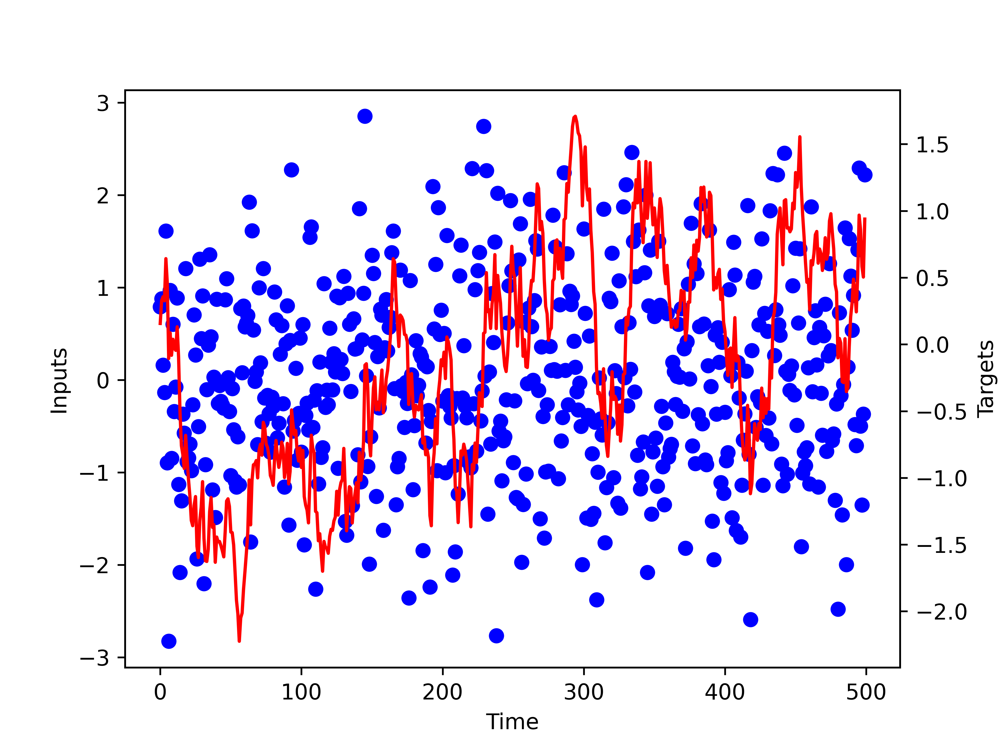
  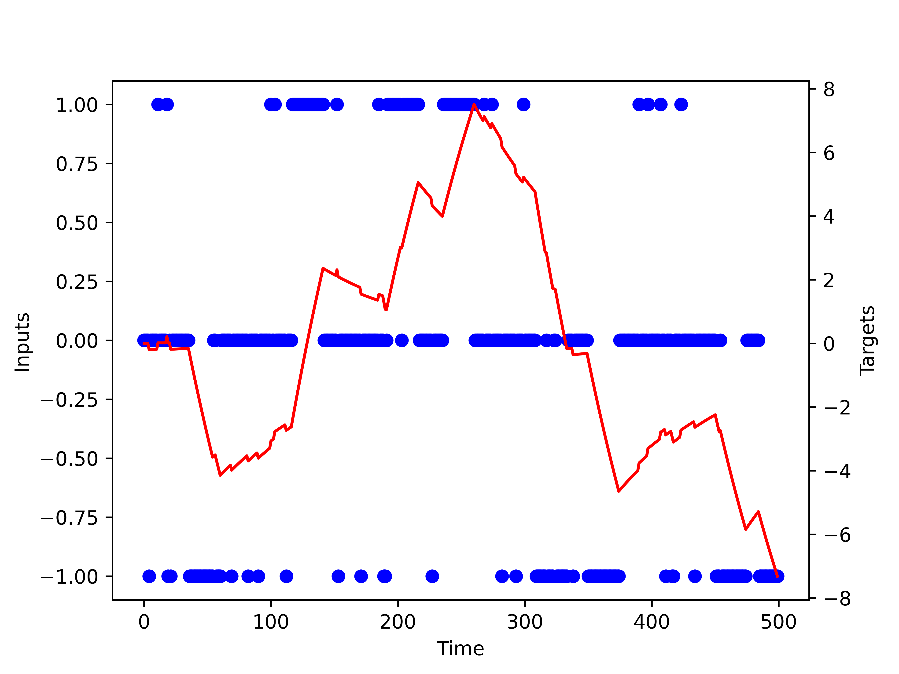
</p>

*Illustration of the exponentially decaying integral task. Inputs are in blue, target outputs in red.*\
Left: training sequences are pure gaussian noise. Right: illustration sequences help distinguish the two main failure modes (scale vs decay). 

Illustration sequences are also inspired by studies on the "Velocity-Position Neural Integrator" of the zebra fish:
* Time is very fine-grained, conceptually of the order of a millisecond.
* At this time-scale, neural signals are binary : "a spike has been exchanged in that time-bin" or not.
* Spikes tend to be exchanged in rapid "bursts", followed by more calm "refractory periods".


# Results:

The most relevant findings are:
* ReLU RNNs reliably generalize from T=3 timesteps training to T=200 testing:

<p align="center">
  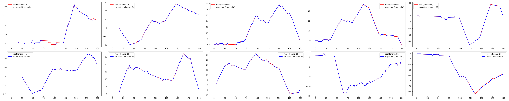
</p>

* RNNs performing $D$ integrals have their internal states live close to a $D$-dimensional manifold.
* Coordinates on the manifold can be computed from the current value of the integrals.

<p align="center">
  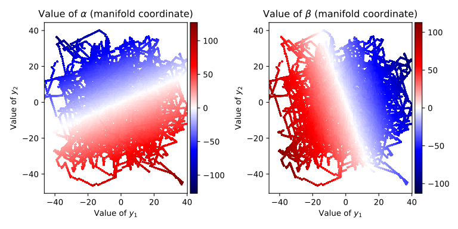
</p>

* Structure of this manifold entails stereotypical neuron activitions, parametrized by *selectivity vector*:
<p align="center">
  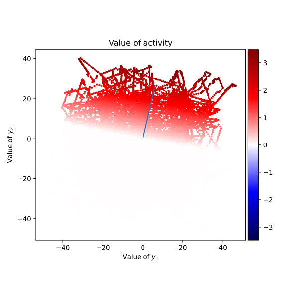
  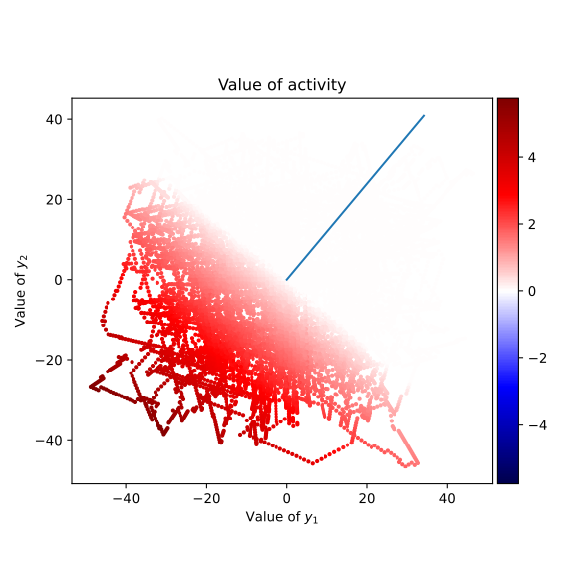
</p>


* Weight-matrices have $D$ large singular values, plus an irrelevant "bulk" (more bulk using Adam):

<p align="center">
  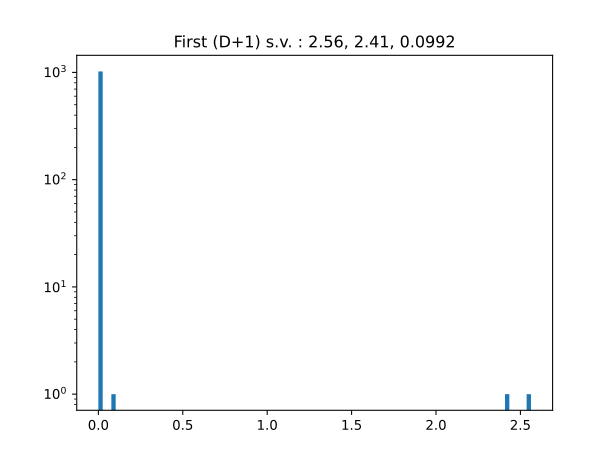
  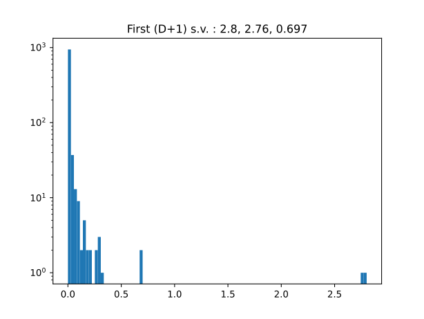
</p>

* Satisfying these conditions is sufficient to guarantee infinite generalization.
* Training a "proxy loss" enforcing them (right) is often easier than standard training, yields similar performance:

<p align="center">
  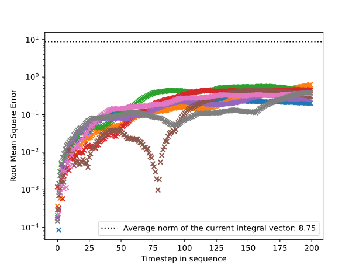
  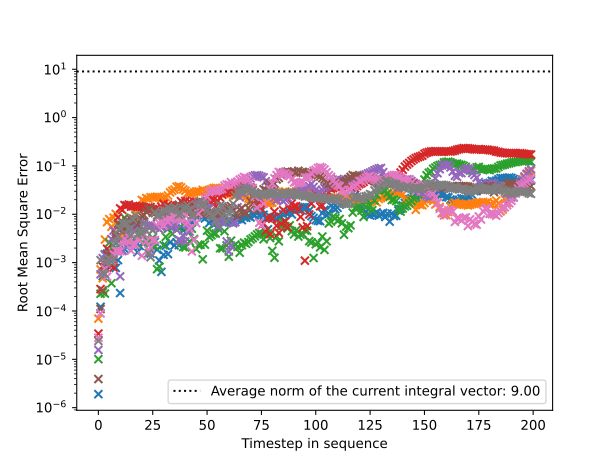
</p>

* Sign constraints on weights (Dale's Law) adds 1 "structural" singular mode, not contributing to the integration.
<p align="center">
  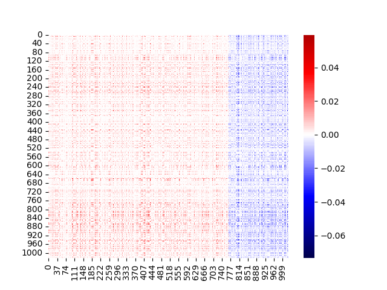
  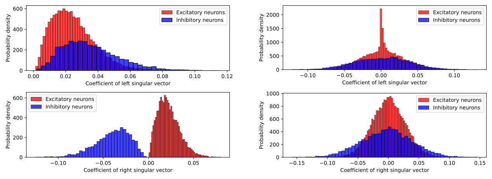
</p>

* Constraints in the input and output vector structure influence weight-matrices topology (again, more noise in Adam).

<p align="center">
  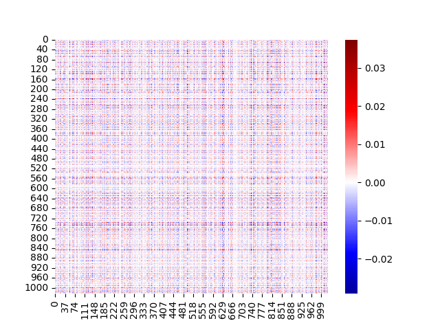
  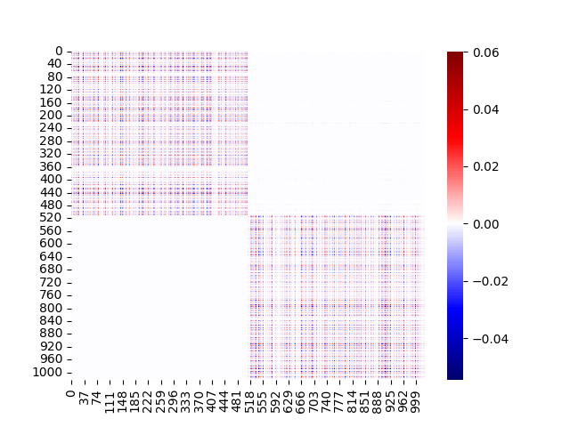
  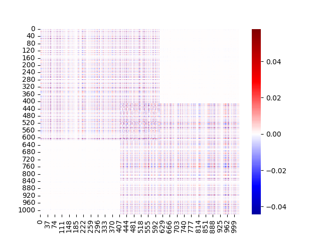
</p>

<p align="center">
  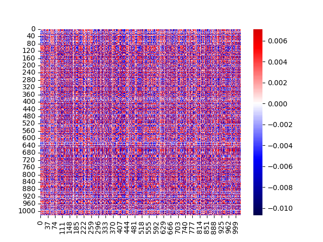
  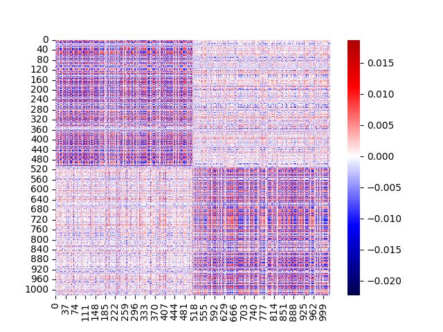
  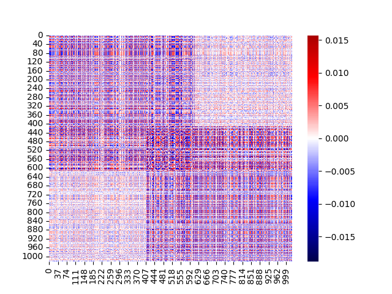
</p>


While other non-linearities can *a priori* fit in this framework, including the sigmoid that we included in the original paper, we find that those are significantly harder to train using both "real" and proxy losses. In particular, it seems that as soon as the non-linearity can be linearized around 0, the optimal solution becomes to reduce weights magnitude until the network behaves effectively in the linear perturbation regime.  

Some unanswered questions:
* Would a "Mixture-of-Integrators" (splitting $n$ neurons into $D$ groups) perform better than dense ?
* Can the poxy loss be extended to more behaviorally relevant tasks ?
* Do GRU/LSTM show similar generalization ? Do they reach better performance when trained directly on long sequences ?

# Rerunning the experiments:

Only GPU machines are supported. We encourage either running the code locally (will require CUDA binaries and CUDA Docker toolkit on the host machine, see https://docs.nvidia.com/datacenter/cloud-native/container-toolkit/latest/install-guide.html for installation instructions), or via Google Cloud where we make a built image available:

After cloning the repository on your chosen machine, please use:
```
bash run.sh python setup.py
```
and make sure the script executes correctly. This script will bind-mount the local "out" folder and use it to precompute some test sequences (~100Mb) and generate some illustrations in the output folder.

Once this is cleared, we suggest running:

```
bash run.sh python 2026_reproduce.py
```

to reproduce the most important findings of the paper without having to go through the very extensive list of experiments
that lead to those results. We also do not present all intermediate checks performed to avoid making things too heavy, but strong emphassis was put on ensuring complete observability of all aspect of our theory.

Because of this, each experiment produces **a lot** of plots for each training run. While those are vector graphics and not heavy on their own, the results folder can easily climb to 10Gb if you rerun everything.


